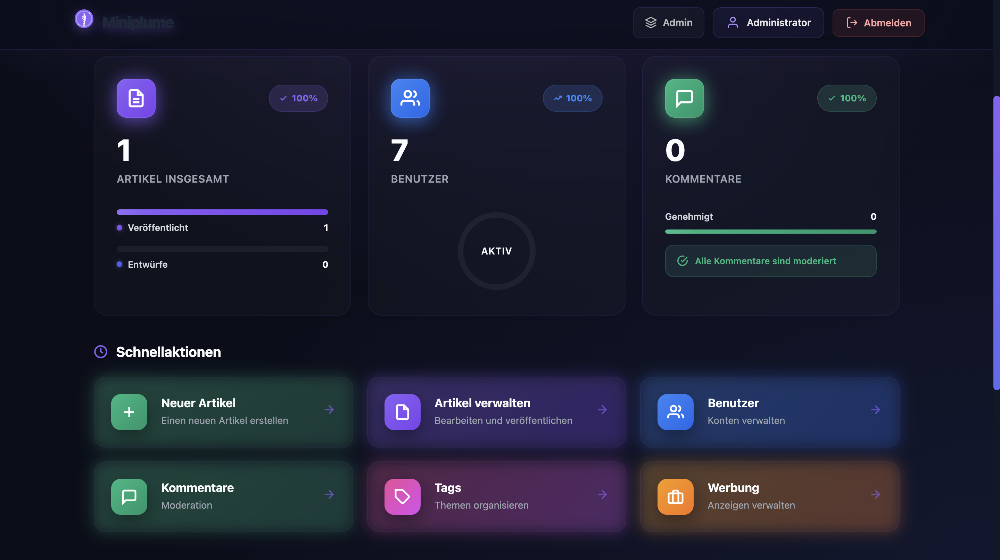

<div align="center">

# 🪶 Miniplume

**A Lightweight, Secure Blog Platform Built with Native PHP**

[](https://www.php.net/)
[](https://www.mysql.com/)
[](LICENSE)
[](https://www.php-fig.org/psr/psr-12/)

[Features](#-features) • [Installation](#-installation) • [Usage](#-usage) • [Screenshots](#-screenshots) • [Documentation](#-documentation)

</div>

---

## 📖 About

**Miniplume** is a minimalist yet powerful blog/CMS platform built entirely with **native PHP 8.2** and **PDO**. It provides a clean, modern interface for publishing technical articles with tags, comments, and advanced content management capabilities—all without relying on heavy frameworks.

Perfect for developers who want:
- 🚀 **Fast performance** - Optimized queries, caching, and minimal overhead
- 🔒 **Security first** - CSRF protection, prepared statements, XSS filtering, rate limiting
- 🎨 **Modern UI** - Beautiful gradient designs with glassmorphism effects
- 🌍 **Multilingual** - Currently available in German (easily extendable)
- 📱 **Responsive** - Mobile-first design that works everywhere

---

## ✨ Features

### 📝 Content Management
- **Post Editor** - Create, edit, and publish articles with rich text support
- **Tag System** - Organize content with tags and browseable tag pages
- **Media Uploads** - Cover images with automatic file handling
- **Scheduled Publishing** - Set future publication dates for posts
- **Draft System** - Save work-in-progress articles

### 💬 Engagement
- **Comment System** - Public comments with moderation workflow
- **Three-tier Moderation** - Approved, pending, and spam filtering
- **User Profiles** - Readers can manage their own comments

### 👥 User Management
- **Role-Based Access Control (RBAC)**
  - **Admin** - Full system access (users, posts, tags, comments, ads)
  - **Author** - Create and manage own articles, view moderation status
  - **Reader** - Comment on posts, manage personal comments
- **Session-based Authentication** - Secure login system
- **User CRUD** - Complete user lifecycle management

### 📊 Advanced Features
- **Advertisement Management** - Create and track ads with position control
- **Analytics** - Track ad views and clicks
- **RSS Feed** - W3C-compliant feed at `/feed.rss`
- **XML Sitemap** - SEO-optimized sitemap at `/sitemap.xml`
- **File Caching** - Lightweight cache for feeds and sitemaps

### 🔐 Security
- ✅ CSRF token protection on all forms
- ✅ Prepared SQL statements (no SQL injection)
- ✅ Password hashing with bcrypt
- ✅ Login rate limiting by IP
- ✅ XSS protection with HTML sanitization
- ✅ Secure session management
- ✅ Role-based authorization checks

---

## 🎯 Tech Stack

| Technology | Purpose |
|------------|---------|
| **PHP 8.2+** | Core application logic |
| **MySQL 8.x** | Database (MariaDB compatible) |
| **PDO** | Database access layer |
| **Native PHP** | Template rendering (no engines) |
| **Vanilla JS** | Interactive UI elements |
| **CSS3** | Modern styling with gradients & glassmorphism |

**No external frameworks or dependencies** - Just pure, clean PHP.

---

## 📸 Screenshots

<div align="center">

### Homepage


*Modern, responsive interface with gradient accents and smooth animations*

</div>

---

## 🚀 Installation

### Prerequisites

- PHP >= 8.2 (CLI or Apache with PHP module)
- MySQL 8.x or MariaDB
- Apache (XAMPP recommended) or PHP built-in server
- Git (for cloning)

### Step-by-Step Setup

#### 1. Clone the Repository

```bash
cd /Applications/XAMPP/xamppfiles/htdocs
git clone https://github.com/yourusername/Miniplume.git
cd Miniplume
```

#### 2. Database Setup

**Create the database:**

```bash
mysql -u root -p
```

```sql
CREATE DATABASE miniplume CHARACTER SET utf8mb4 COLLATE utf8mb4_unicode_ci;
EXIT;
```

**Import the schema:**

```bash
mysql -u root -p miniplume < database/schema.sql
mysql -u root -p miniplume < database/create_ads_table.sql
```

#### 3. Configure Database Connection

Edit `/app/Config/Database.php` with your credentials:

```php
return [
    'host' => 'localhost',
    'port' => 3306,
    'database' => 'miniplume',
    'username' => 'root',
    'password' => 'your_password',
    'charset' => 'utf8mb4'
];
```

#### 4. Set Up Default Users

The schema includes sample users. **Update their passwords:**

```sql
UPDATE users SET password_hash = '$2y$10$YOUR_HASHED_PASSWORD' WHERE email = 'admin@example.com';
```

Or use PHP to generate a hash:

```php
echo password_hash('your_secure_password', PASSWORD_DEFAULT);
```

#### 5. Configure Permissions

```bash
# Make uploads directory writable
chmod -R 755 public/uploads
chown -R www-data:www-data public/uploads  # Linux/Apache

# For XAMPP on macOS
chmod -R 777 public/uploads
```

#### 6. Start the Server

**Option A: PHP Built-in Server (Development)**

```bash
cd /Applications/XAMPP/xamppfiles/htdocs/Miniplume
php -S localhost:8000 -t public
```

**Option B: Apache/XAMPP (Production-ready)**

Just navigate to `http://localhost/Miniplume/public`

---

## 🎮 Usage

### Default Credentials

| Role | Email | Password |
|------|-------|----------|
| Admin | `admin@example.com` | *(set during setup)* |
| Author | `alice@example.com` | *(set during setup)* |

### Quick Start Guide

1. **Login** - Navigate to `/login` with admin credentials
2. **Create Tags** - Go to Admin → Tags to create categories
3. **Write a Post** - Admin → Posts → New Post
4. **Publish** - Set a cover image, add tags, and publish
5. **Moderate Comments** - Admin → Comments to approve/reject

### URL Structure

```
/                    → Homepage (published posts)
/post/{slug}         → Single post view
/tag/{slug}          → Posts by tag
/login               → Authentication
/admin               → Admin dashboard
/admin/posts         → Post management
/admin/tags          → Tag management
/admin/comments      → Comment moderation
/admin/users         → User management
/admin/ads           → Advertisement management
/me/articles         → Author's post management
/me/comments         → Reader's comment management
/feed.rss            → RSS feed
/sitemap.xml         → XML sitemap
```

---

## 🏗️ Project Structure

```
Miniplume/
├── app/
│   ├── Config/          # Configuration files
│   ├── Controllers/     # Request handlers
│   │   ├── Admin/       # Admin panel controllers
│   │   ├── AuthController.php
│   │   ├── CommentController.php
│   │   └── PostController.php
│   ├── Models/          # Database models (PDO)
│   │   ├── User.php
│   │   ├── Post.php
│   │   ├── Tag.php
│   │   ├── Comment.php
│   │   └── Ad.php
│   └── Views/           # PHP templates
│       ├── layouts/     # Base layouts
│       ├── admin/       # Admin views
│       └── components/  # Reusable components
├── database/
│   ├── schema.sql       # Main database schema
│   └── create_ads_table.sql
├── public/              # Web root
│   ├── index.php        # Front controller
│   ├── app.css          # Main stylesheet
│   └── uploads/         # User-uploaded files
├── Doc/                 # Documentation & screenshots
└── README.md
```

---

## 🔒 Security Features

### CSRF Protection

All forms include CSRF tokens:

```php
<?= csrf_field() ?>
```

Validated automatically in controllers.

### SQL Injection Prevention

Using PDO prepared statements:

```php
$stmt = $pdo->prepare("SELECT * FROM posts WHERE id = ?");
$stmt->execute([$id]);
```

### XSS Protection

Output escaping with `esc()` helper:

```php
<?= esc($user_input) ?>
```

### Rate Limiting

Login attempts are tracked by IP with automatic lockout.

### Session Security

- Secure session configuration
- HTTP-only cookies
- Session regeneration on login

---

## 📚 Documentation

### Creating a New Controller

```php
<?php
namespace App\Controllers;

class ExampleController {
    public function index() {
        // Your logic here
        return view('example/index', ['data' => $data]);
    }
}
```

### Adding a New Route

Edit `/public/index.php`:

```php
$router->get('/example', [ExampleController::class, 'index']);
```

### Database Queries

```php
use App\Models\Post;

$postModel = new Post($pdo);
$posts = $postModel->published(1, 10); // page, limit
```

---

## 🌐 Localization

Miniplume is currently available in:
- 🇩🇪 **German** (Deutsch) - Complete translation

All UI text is in German. To add new languages:
1. Translate view files in `/app/Views/`
2. Update flash messages in controllers
3. Modify language-specific content

---

## 🎨 Customization

### Color Scheme

The platform uses CSS custom properties. Edit `/public/app.css`:

```css
:root {
  --primary: #8b5cf6;      /* Purple */
  --secondary: #ec4899;    /* Pink */
  --background: #0f0f23;   /* Dark */
  --text-primary: #e2e8f0;
  --text-muted: #94a3b8;
}
```

### Logo

Replace logo SVG in `/app/Views/layouts/base.php` or add your own image.

---

## 🤝 Contributing

Contributions are welcome! Please follow these guidelines:

1. **Fork** the repository
2. **Create** a feature branch (`git checkout -b feature/amazing-feature`)
3. **Commit** your changes (`git commit -m 'Add amazing feature'`)
4. **Push** to the branch (`git push origin feature/amazing-feature`)
5. **Open** a Pull Request

### Code Standards

- Follow PSR-12 coding standards
- Use type declarations
- Write descriptive commit messages
- Add comments for complex logic

---

## 📝 License

This project is licensed under the MIT License - see the [LICENSE](LICENSE) file for details.

---

## 🙏 Acknowledgments

- Built with ❤️ using native PHP
- Inspired by minimalist design principles
- Icons from SVG sources
- Modern UI/UX patterns

---

## 📞 Support

For issues, questions, or contributions:

- 🐛 [Report a Bug](https://github.com/yourusername/Miniplume/issues)
- 💡 [Request a Feature](https://github.com/yourusername/Miniplume/issues/new)
- 📧 Contact: zaksab98@gmail.com

---

<div align="center">

**Made with PHP & Passion**

⭐ Star this repo if you find it useful!

[Back to Top](#-miniplume)

</div>
